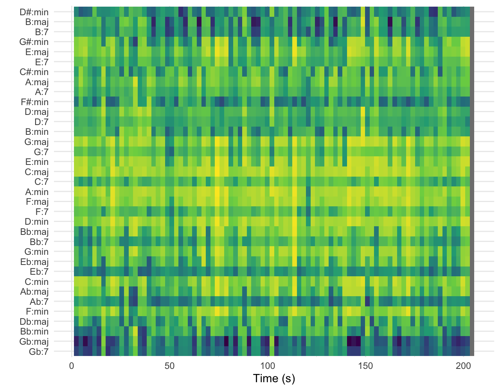

# Page 1: Chordogram

## Column {width="40%"}

### Row {height="20%"}
This page will explain the chordogram of the song: Fool's Gold covered by Niall Hooran.

### Row {height="80%"}
On the right the chordogram of Fool's Gold shows certain chords being played. The lightest colors tell the most the chord being played to be most likely. In this case G:maj, E:min, C:maj, A:min, F:maj are most frequent. Not only are they the brightest at around t=70s but they are bright overall. The horizontal line is clearly visible. Take G#:min and E:maj for example. They are bright at t=70s but not really active in the rest of the song. That could be because of a temporary key changre or just simply noise / singing voices hitting that chord.

## Column {width="60%"}

### Row {height = "100%"}

{width=100%}
