# Introduction

## Column {width="40%"}

### Row {height="100%"}

This portfolio explores the musical characteristics of One Direction in comparison to the solo work of its former members: Harry Styles, Niall Horan, ZAYN, Louis Tomlinson, and Liam Payne. The corpus consists of all available tracks released by One Direction, complemented by the complete solo discographies of each of these artists. This design enables a structured comparison between a collective musical identity and its individual continuations.

The central question guiding this analysis is:
To what extent do the solo works of former One Direction members retain, diverge from, or reinterpret the musical characteristics of the band?

To address this question, the analysis combines multiple levels of musical representation derived from the Spotify API and audio-based features. Track-level features such as energy, loudness, acousticness, and valence are used to capture general stylistic tendencies. In addition, more detailed audio representations, such as chroma features, timbre descriptors, and temporal structures are used to investigate harmonic, spectral, and rhythmic properties.

The comparison is approached in two complementary ways. First, descriptive analyses are used to identify general trends and differences between One Direction and the individual artists. Second, clustering techniques are applied to explore whether songs group naturally according to artist, and to what extent solo material remains stylistically close to the original band sound.

By combining these approaches, this portfolio aims to provide insight into how a shared musical identity evolves when distributed across individual artistic trajectories. The results may reveal whether the members maintain a recognizable “One Direction sound” or develop distinct stylistic profiles in their solo careers.

## Column {width="60%"}

### Row {height="100%"}

This playlist contains the corpus used for the analyses in this dashboard. It provides an overview of the selected tracks and offers musical context for the visualisations shown below.

<iframe
  src="https://open.spotify.com/embed/playlist/19BNIRl2aI5JTsNWEZmagK?utm_source=generator"
  width="100%"
  height="352"
  style="border-radius:12px;"
  frameborder="0"
  allowfullscreen
  allow="autoplay; clipboard-write; encrypted-media; fullscreen; picture-in-picture"
  loading="lazy">
</iframe>

# Track-level Features

## Column {width="40%"}

### Row {height="100%"}

This section examines the distribution of Spotify track-level features across One Direction and the solo careers of its former members. The analysis focuses on energy, loudness, and acousticness, as these features provide a clear indication of stylistic differences in intensity, production, and musical texture.

The boxplots show that One Direction occupies the highest-energy region overall, with a relatively high median and a consistent distribution of energetic tracks. This reflects the band’s positioning within mainstream pop, where songs are typically produced to be dynamic and high-impact. In contrast, ZAYN shows the lowest median energy, with a wider spread towards lower values, indicating a more subdued and less energetic musical style.

A similar pattern can be observed for acousticness. One Direction has consistently low acousticness values, suggesting a strongly produced, studio-oriented sound. By contrast, ZAYN and Harry Styles show higher acousticness, indicating a greater presence of stripped-down or less heavily produced tracks. Louis Tomlinson shows the lowest acousticness overall, aligning more closely with the production-heavy style of One Direction.

The relationship between energy and loudness further clarifies these differences. The scatterplot shows a strong positive relationship: songs with higher energy are generally also louder. One Direction clusters in the high-energy, high-loudness region, confirming its consistent pop production style. In contrast, ZAYN’s tracks are more dispersed towards lower loudness and energy, reinforcing the idea of a more restrained or atmospheric sound. The other solo artists, particularly Harry Styles and Niall Horan, occupy intermediate positions, overlapping partially with One Direction but also extending into less intense regions of the feature space.

Point size, representing acousticness, reveals an additional pattern: larger points (more acoustic tracks) are predominantly found in the lower-energy, lower-loudness region. This suggests a systematic relationship between production style and musical intensity, where more acoustic tracks tend to be softer and less energetic.

Loudness patterns show that One Direction tracks are generally louder and more consistent, reflecting a polished production style. In contrast, ZAYN’s tracks tend to have lower loudness levels, aligning with a more restrained and atmospheric sound. The other solo artists fall in between, showing partial overlap with the band’s original production style.

Overall, these results indicate that while some solo artists remain close to the original One Direction sound, the group’s musical identity does not persist uniformly across all members. Instead, the transition to solo careers results in diverging stylistic trajectories, with ZAYN showing the strongest departure and Harry Styles and Louis Tomlinson remaining closer to the band’s original profile. These feature-level differences provide a foundation for the clustering analysis that follows.

## Column {width="60%"}

### Row {height="33%"}

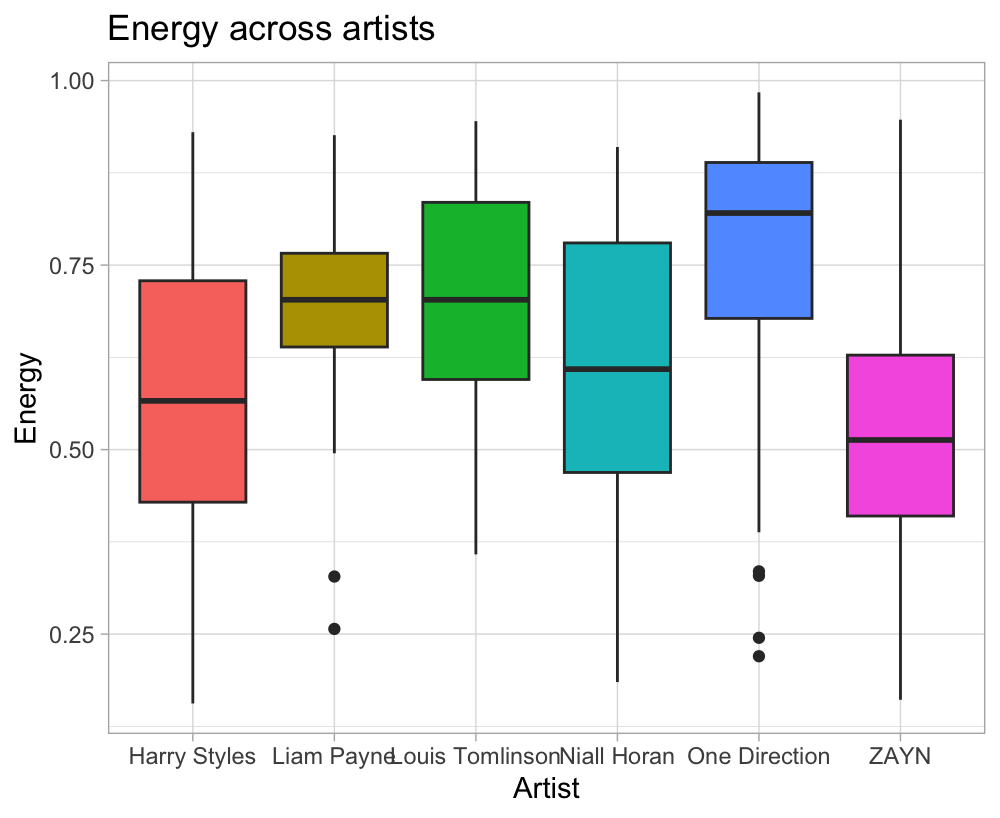{width="100%"}
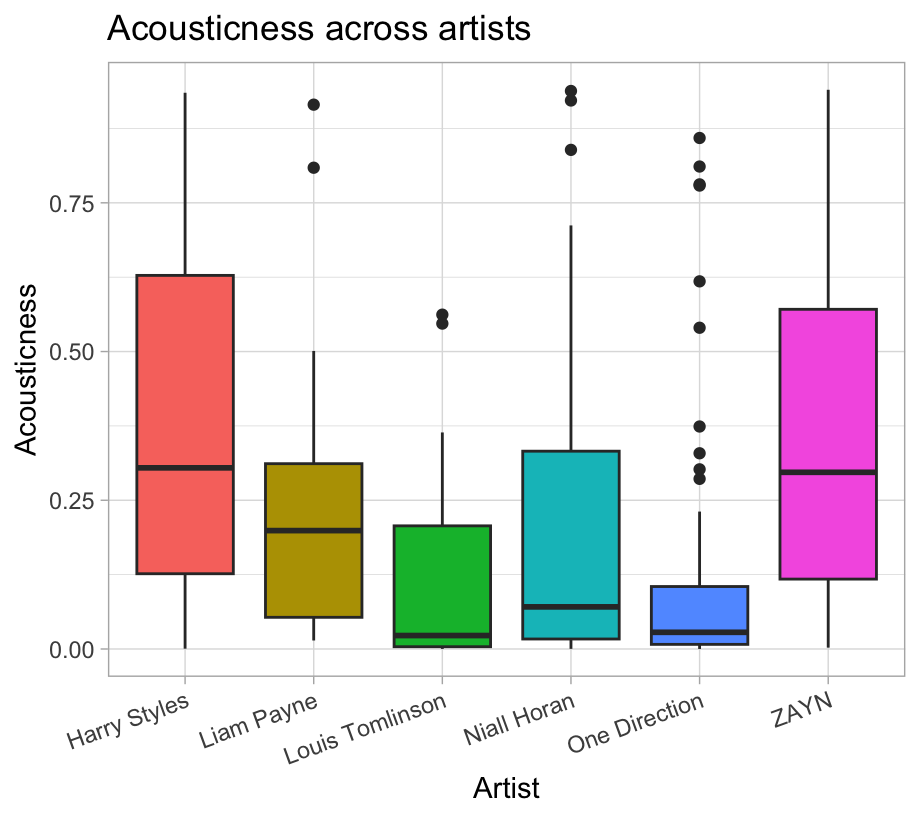{width="100%"}
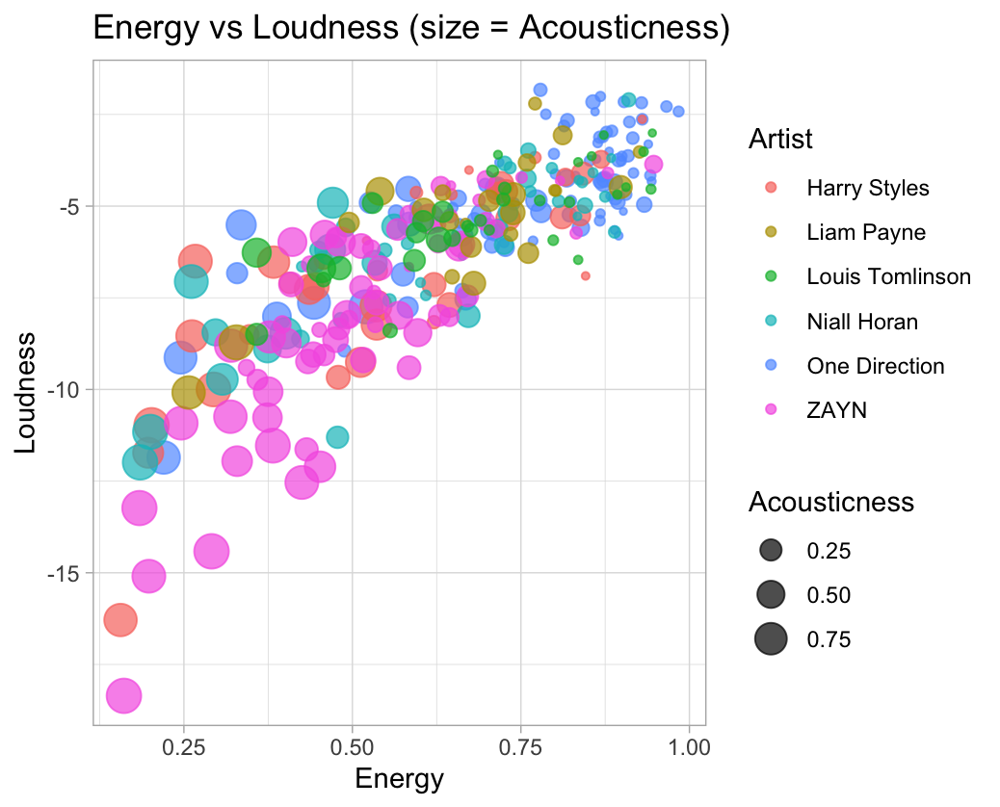{width="100%"}
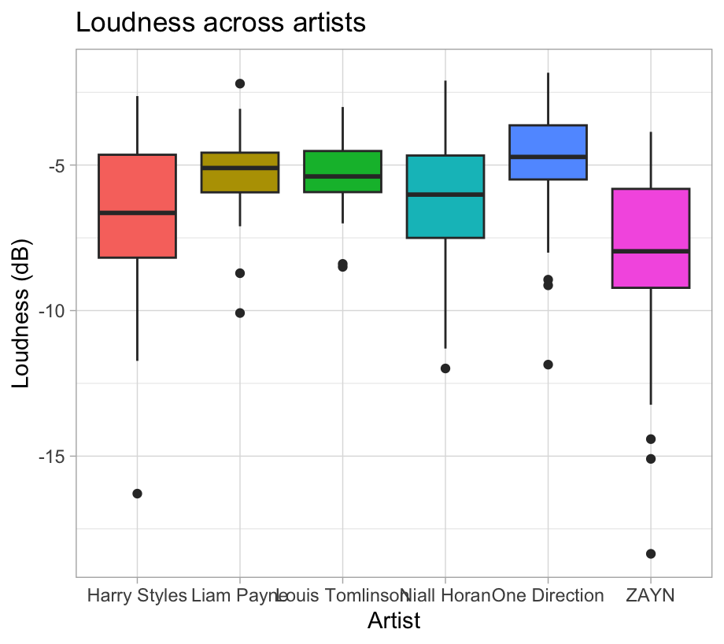{width="100%"}

# Harmonic Features
## Column {width="40%"}

### Row {height="100%"}

The chromagram of Fool’s Gold (Niall Horan) shows a clear concentration of energy in a limited set of pitch classes, most prominently G major, E minor, C major, A minor, and F major. These chords appear consistently throughout the track, forming stable horizontal bands in the chromagram. This indicates a relatively harmonically stable structure, with recurring chord progressions that are characteristic of mainstream pop songwriting.

At specific moments, most notably around 70 seconds, additional pitch classes briefly become more prominent. These short-lived activations likely reflect transitional harmonic events, such as passing chords or vocal harmonics, rather than structural changes in the underlying progression.

The overall pattern suggests that the track relies on a limited harmonic palette, with strong repetition and clear tonal centres. This aligns with the stylistic tendencies observed in the track-level features, where accessibility and consistency are central. Compared to more complex harmonic music, the chromagram reveals relatively little chromatic movement, reinforcing the idea of a diatonically grounded pop structure.

Importantly, this type of harmonic simplicity does not imply a lack of musical interest. Instead, it reflects a compositional strategy in which variation is achieved through timbre, production, and arrangement, rather than through harmonic complexity. In the context of this corpus, such patterns can be used to compare whether solo work maintains similar harmonic conventions or explores more diverse pitch structures.

These observations provide a basis for comparing whether the harmonic language of the solo artists remains aligned with the collective sound of One Direction or diverges in complexity and tonal variation.

## Column {width="60%"}

### Row {height = "100%"}

{width="100%"}

# Temporal & Structural Features

## Column {width="40%"}

### Row {height="100%"}

The tempograms show how rhythmic periodicities evolve over time. In the One Direction version, several clear horizontal bands are visible across the entire duration of the track, most notably around a consistent tempo level. These stable lines indicate a strong and steady pulse, suggesting a tightly produced rhythmic structure with clearly defined metrical regularity. The repetition of these bands at different tempo multiples reflects a coherent hierarchical rhythm, typical of highly produced pop arrangements.

In contrast, the Niall Horan version displays a much more diffuse and fragmented pattern. While similar tempo regions are present, the horizontal bands are less continuous and more variable in intensity over time. This suggests a looser rhythmic interpretation, with less emphasis on a strictly enforced pulse. The energy is distributed across a wider range of tempi, indicating more flexibility in timing and a less rigid production style.

These differences in temporal clarity are reflected in the self-similarity matrices. Both versions show a strong diagonal line and clear block structures, confirming that the overall song form (e.g., verses and choruses) remains consistent. However, the internal structure differs significantly.

The One Direction matrix exhibits a dense and highly textured pattern, with many fine-grained vertical and horizontal lines. This indicates frequent timbral variation and a complex layering of musical elements, such as multiple vocal lines and instrumental textures. The result is a rich but less homogeneous structure, where sections are internally varied and transitions are more intricate.

By contrast, the Niall Horan matrix shows more pronounced and regular grid-like patterns, with clearer horizontal and vertical bands. These patterns indicate longer stretches of similar timbral content and stronger repetition across sections. The structure appears more segmented and internally consistent, reflecting a simpler and more stable arrangement.

Taken together, the tempograms and self-similarity matrices suggest that the One Direction version is characterised by rhythmic stability combined with high timbral complexity, whereas the Niall Horan version exhibits greater rhythmic variability but reduced timbral diversity. This highlights how production choices can reshape both the temporal feel and the internal structure of the same song.

## Column {width="60%"}

### Row {height="25%"}

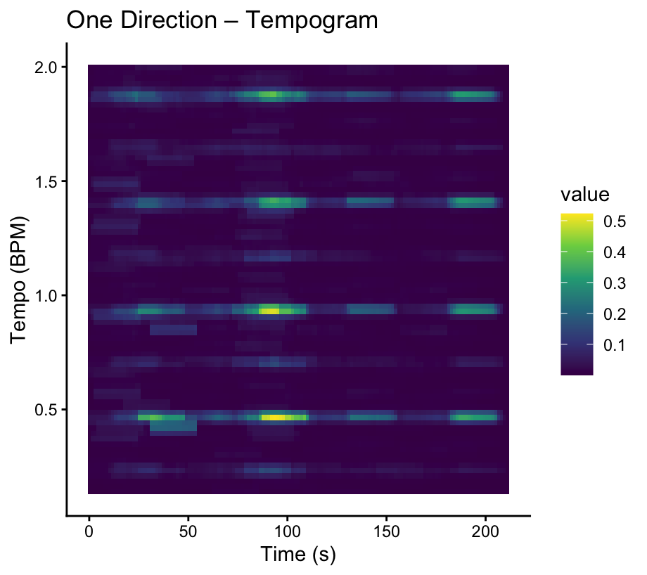{width="100%"}
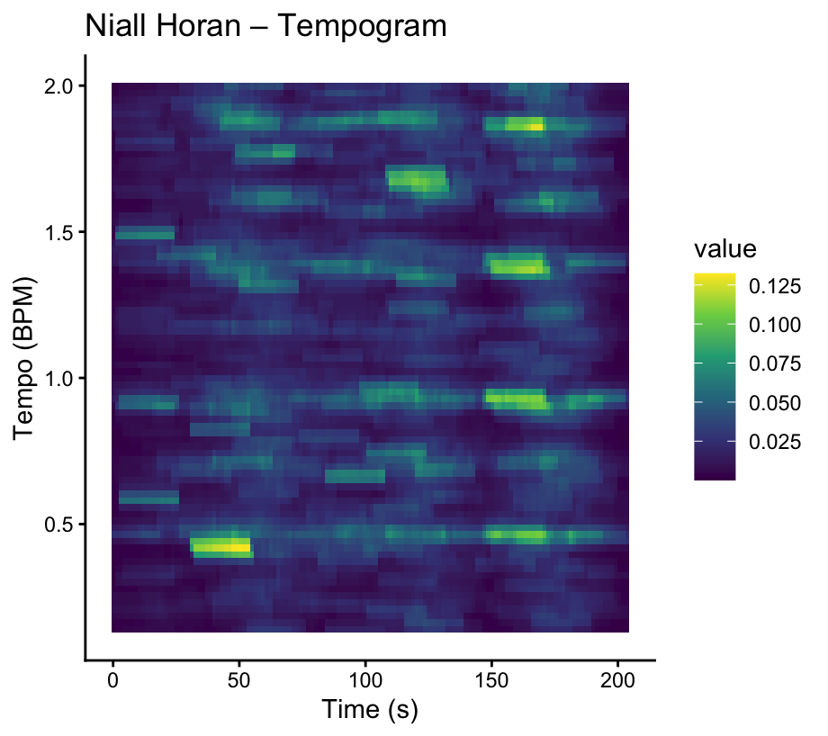{width="100%"}
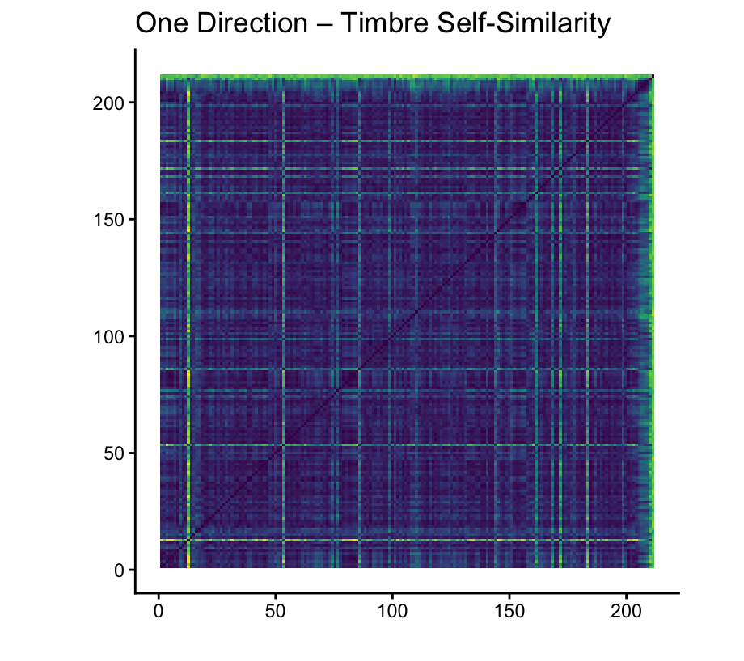{width="100%"}
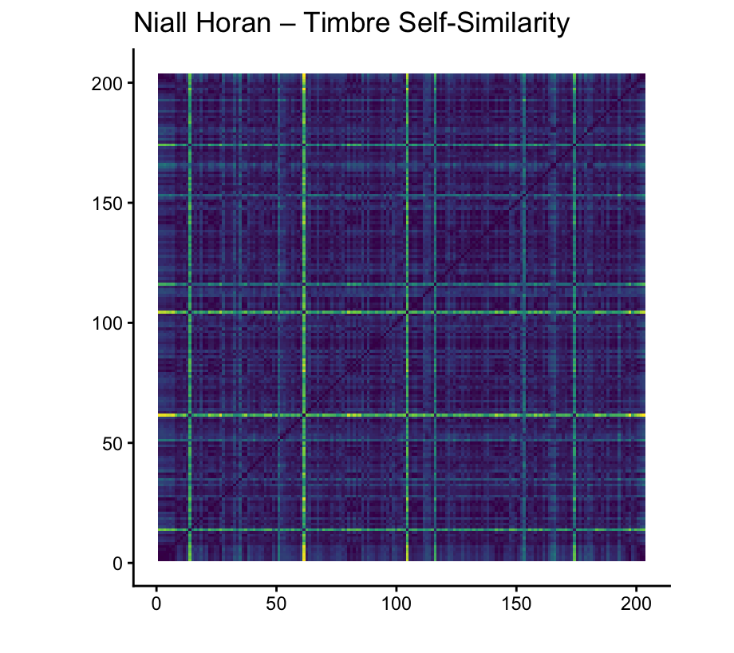{width="100%"}

# Audio Texture

## Column {width="40%"}

### Row {height="100%"}

This section compares the sound texture of the One Direction and Niall Horan versions of Fool’s Gold using cepstrograms.

The cepstrograms show that the two versions differ in how their sound develops over time. In the One Direction version, the horizontal bands remain relatively even across the track. This suggests a stable and controlled sound, with less variation in the overall texture. The different musical layers appear to be blended into a polished and consistent whole.

In the Niall Horan version, the pattern changes more clearly over time. Some bands become stronger or weaker at different moments, which points to more variation in the sound. This suggests a less uniform texture, with clearer shifts in instrumentation or vocal colour.

A noticeable difference is that the One Direction cepstrogram looks smoother overall, while the Niall Horan version contains stronger contrasts in several bands. This makes the solo version feel more flexible and less tightly standardised in production.

Overall, the One Direction version seems more consistent and polished in its sound, whereas the Niall Horan version shows more variation in texture. Even though both recordings are based on the same song, the cepstrograms suggest that they create a different listening experience through their timbre and production style. This indicates that while the model captures general stylistic differences, it is not able to perfectly separate all artists.

## Column {width="60%"}

### Row {height="50%"}

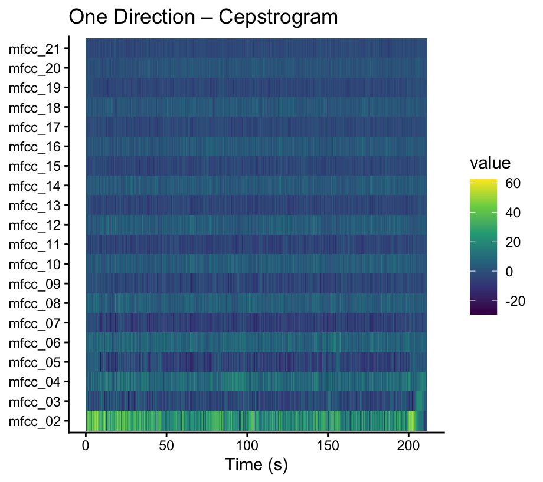{width="100%"}

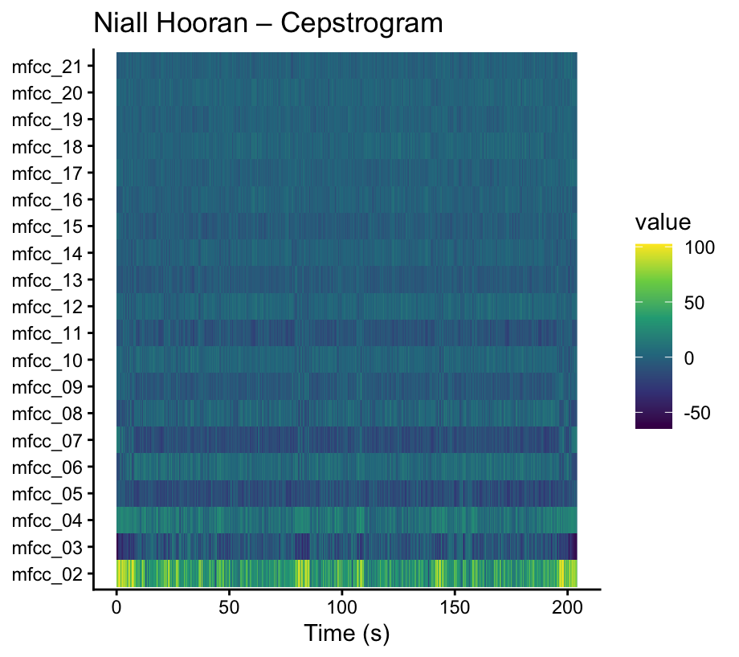{width="100%"}

# Clustering

## Column {width="40%"}

The clustering analysis shows how well the selected features; loudness, energy, and acousticness, can distinguish between One Direction and the solo artists.

The feature importance graph indicates that loudness and energy are the most influential variables, followed by acousticness. This suggests that differences in production intensity and sound texture are key factors in separating the artists.

The confusion matrix shows that most artists can be classified reasonably well, with One Direction being recognised most consistently. This indicates that the band maintains a relatively distinct feature profile. However, there is also noticeable overlap between some solo artists and the group.

In particular, Harry Styles is frequently misclassified, suggesting that his music shares many characteristics with other artists in the corpus. This aligns with earlier analyses, where his tracks often overlapped with One Direction in terms of energy and loudness.

The scatterplot further supports this interpretation. While One Direction tends to cluster in the high-energy, high-loudness region, several solo artists, especially Harry Styles and Louis Tomlinson, occupy similar areas in the feature space. In contrast, ZAYN is positioned further away, with lower energy and loudness and higher acousticness, indicating a clearer stylistic divergence.

Overall, the clustering results suggest that some solo artists remain close to the original One Direction sound, while others develop more distinct musical profiles. This supports the idea that the band’s musical identity is only partially preserved across individual careers.

## Column {width="60%"}

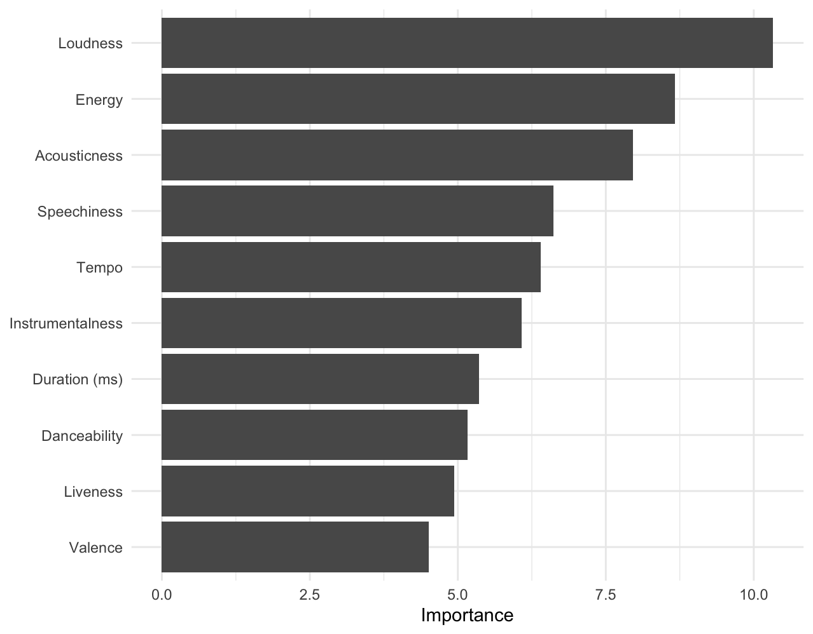{width="100%"}

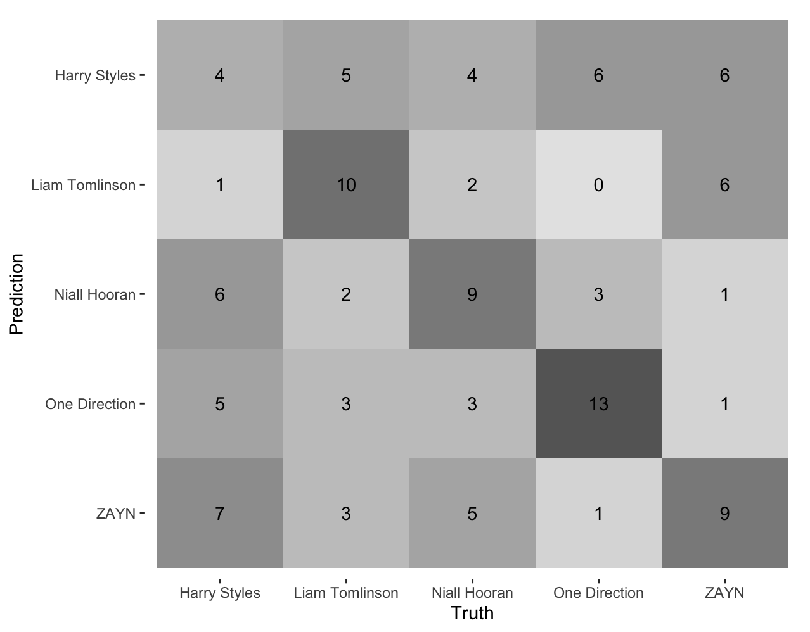{width="100%"}

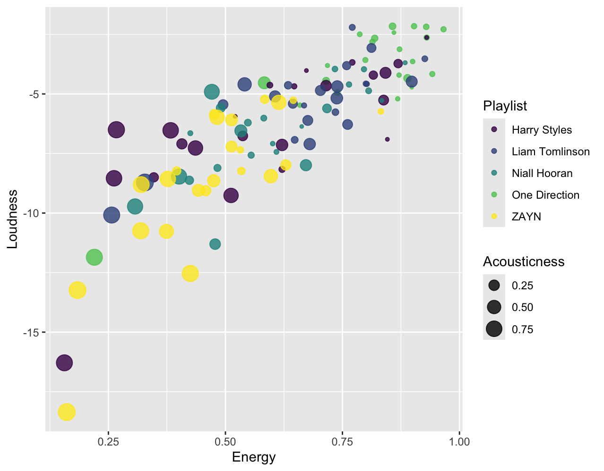{width="100%"}

# Conclusion

This portfolio examined to what extent the solo work of former One Direction members retains, diverges from, or reinterprets the musical characteristics of the band. Across the different analyses, a clear pattern emerges: the musical identity of One Direction does not simply continue unchanged in the solo careers of its members, but it also does not disappear completely. Instead, it develops into several distinct stylistic directions.

At the track level, One Direction stands out as consistently high in energy and loudness, with relatively low acousticness. This gives the band a strongly produced and recognisable mainstream pop profile. Among the solo artists, ZAYN shows the clearest departure from this profile, with lower energy and loudness and a more acoustic or restrained sound. Harry Styles and Louis Tomlinson remain closer to the original One Direction feature space, while Niall Horan occupies a more intermediate position.

The harmonic analysis suggests that the main differences do not lie in harmonic complexity. The chromagram of Fool’s Gold shows a relatively stable and repetitive harmonic structure based on a limited set of recurring chords. This points to a harmonic language that remains closely tied to mainstream pop conventions.

The strongest differences emerge in rhythm, structure, and timbre. The comparison between the One Direction and Niall Horan versions of Fool’s Gold shows that the One Direction version has a clearer and more stable rhythmic pulse, while the Niall version is rhythmically more diffuse. The self-similarity matrices and cepstrograms further show that the One Direction version is more layered and internally varied, whereas the Niall version is more consistent and less densely produced.

The clustering analysis confirms that these differences are meaningful, even if they do not produce perfect separation between all artists. Loudness, energy, and acousticness are particularly useful for distinguishing between the artists. At the same time, the overlap between One Direction and some solo artists shows that parts of the original band identity remain present in their later work.

Overall, this project shows that the “One Direction sound” functions less as a fixed style and more as a shared starting point. From that common origin, the solo artists move in different directions, some remaining close to the band’s original sound and others establishing more distinct musical identities.

# Contribution

This project has shown me that computational musicology can make stylistic differences visible in a way that would be difficult to express through listening alone. By combining track-level features with more detailed analyses of harmony, rhythm, structure, and timbre, it became possible to move from a general impression of similarity or difference to a more precise and evidence-based interpretation.

One important thing I learned is that different analytical levels reveal different aspects of musical identity. Track-level features were useful for identifying broad stylistic tendencies, such as energy, loudness, and acousticness. However, the more detailed analyses showed that these broad tendencies do not tell the whole story. Harmonic structure turned out to be relatively stable, while larger differences emerged in production, rhythmic clarity, and timbral texture. This made clear that musical identity is multi-layered and cannot be reduced to a single feature or method.

I also learned that comparing two versions of the same song can be especially powerful. Because the composition itself remains constant, differences in the analysis can be interpreted more confidently as differences in arrangement, performance, and production. This made the comparison between One Direction and Niall Horan’s versions of Fool’s Gold one of the most informative parts of the project.

More broadly, the findings could be useful for music producers, artists, and researchers. Producers and artists may benefit from understanding how changes in loudness, texture, and rhythmic organisation affect the identity of a track. Researchers in popular music and musicology may find this kind of approach valuable for studying how group identities persist or change when artists move into solo careers.

In that sense, the project contributes both analytically and conceptually. Analytically, it shows that computational methods can capture meaningful stylistic differences between closely related artists. Conceptually, it suggests that musical identity is not simply preserved or abandoned, but reshaped across different dimensions of sound.
