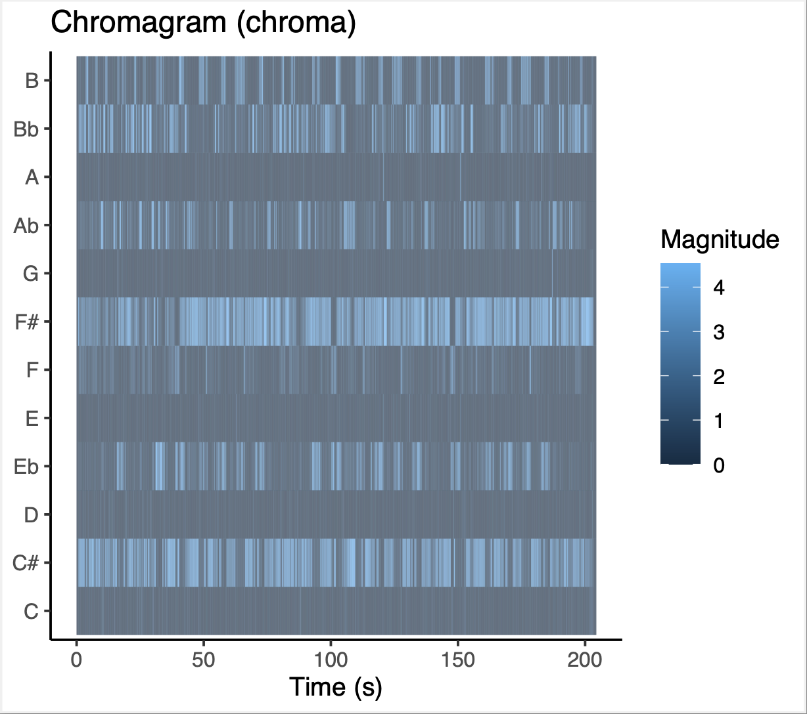
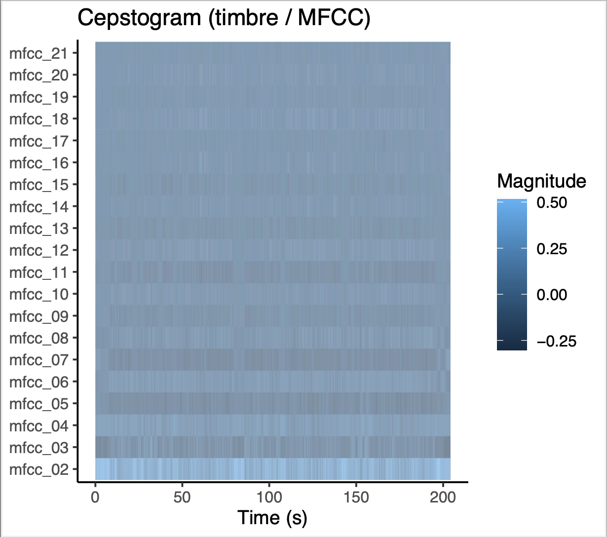
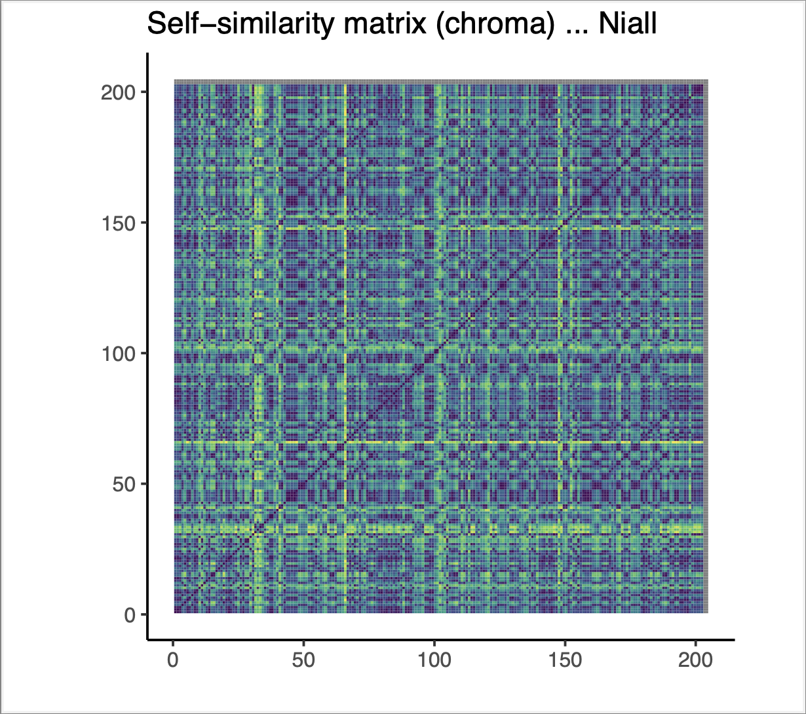
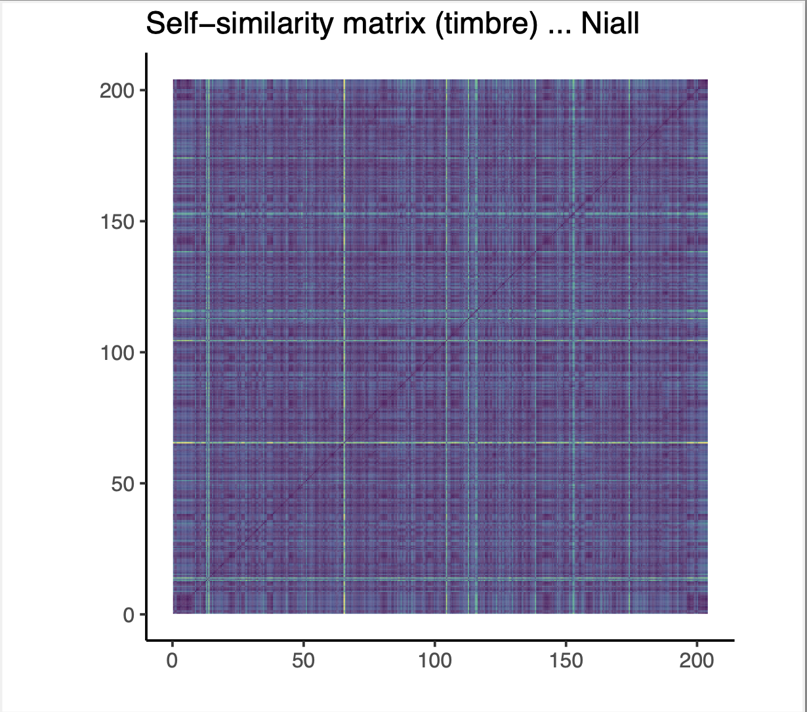

# Week 9 Homework
### Justin van Egmond - 15011178
#### 27-02-2025

---

# Fool’s Gold – Niall Horan  
## Feature-Based Analysis

---
## 1. Chromagram  

The chromagram shows the most common notes played in the song. In Fool's Gold by Niall Hoorann the most frequent tones are F#, C#, Bb and Eb. Most frequent is F#. However Eb only shows up certain times. Most likely the chorus. 

## 2. Cepstogram (Timbre)

The cepstogram is still a vague concept to me. I see that the lowest sounds are most frequent. There isn't a lot of variation in the song. Mostly the lowest. I have listened to the song and it does make sense. It is an accoustic version of the song 1 Direction once made. So it makes sense that there's isn't a lot of variation in the sounds.

## 3. Self-Similarity Matrix – Chroma  

There is a lot of similarity in certain times. Mostly t t=40 with t=100 and t=150. Most likely the chorus. In general there is a lot of harmonic repitition.

## 4. Self-Similarity Matrix – Timbre  

There are some lines in the graph. However, not a lot of clear blocks or bright spaces are seen. That still makes sense due to that everything is monotome. So not a lot of changes in sounds or volume is measured. 

## Comparison
To compare the two graphs. The SSM from the chromagraph shows a lot of bright overlap because variations in tones are measured. It is easily observable where the chorus comes and goes. The timbre SSM isn't that visible in sections. The whole song is someone the same. However, at t = 65 and t = 120 the same lines are visible. That means that there is probably some change or occurance happening. 

